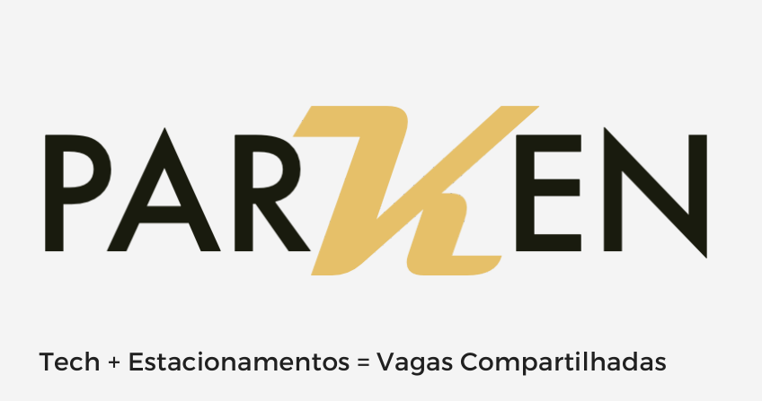

# KrakenStartup - Parken



Parken is an iOS application developed as a final project for the Information Systems course at FIAP. The app aims to connect drivers with available parking spaces, providing a seamless and efficient way to find and book parking.


## Features

*   **User Authentication:** Secure sign-up and login functionality.
*   **Parking Garage Management:** View and manage parking garage details.
*   **Real-time Chat:** Communicate with parking space owners.
*   **Payment Processing:** Integrated payment system for booking.
*   **Booking and Confirmation:** Book and confirm parking spaces in real-time.
*   **Request History:** Keep track of all your parking requests and history.

## Technologies & Dependencies

*   **Swift:** The primary programming language for iOS development.
*   **Firebase:**
    *   **Authentication:** For user management.
    *   **Database:** For real-time data storage.
    *   **Analytics:** For usage tracking.
*   **Alamofire:** For network requests.
*   **PhoneNumberKit:** For phone number validation and formatting.
*   **SGCodeTextField:** For verification code input fields.
*   **Jelly:** For custom view controller transitions and animations.
*   **IQKeyboardManagerSwift:** To manage keyboard interactions with text fields.
*   **SwiftMaskTextfield:** For masking text fields.

## Getting Started

To get a local copy up and running, follow these simple steps.

### Prerequisites

*   Xcode 12.0 or later
*   CocoaPods

### Installation

1.  **Clone the repo**
    ```sh
    git clone https://github.com/JulioCesar82/kraken-startup-view.git
    ```
2.  **Install CocoaPods packages**
    ```sh
    cd client-ios
    pod install
    ```
3.  **Firebase Setup**
    *   This project uses Firebase for its backend services. You will need to set up your own Firebase project and add the `GoogleService-Info.plist` file to the `client-ios/Parken/` directory.

4.  **Open the project**
    *   Open the `.xcworkspace` file in Xcode.
    ```sh
    open Parken.xcworkspace
    ```

## Documentation

For more detailed information about the project, please refer to the following documents:

*   [Application Architecture](docs/architecture.md)
*   [Authentication Feature](docs/features/authentication.md)
*   [Garage Feature](docs/features/garage.md)
*   [Chat Feature](docs/features/chat.md)
*   [Payment Feature](docs/features/payment.md)
*   [Booking and Confirmation Feature](docs/features/booking.md)

## Screenshots

| Splash Screen | Access | Home |
| :---: | :---: | :---: |
|  |  |  |

| Menu | Wallet | Garage |
| :---: | :---: | :---: |
|  |  |  |

## Current project team members

* [JulioCesar82](https://github.com/JulioCesar82) -
**Julio Ávila** <https://www.linkedin.com/in/juliocesar82>

## How to Contribute

Contributions are what make the open-source community such an amazing place to learn, inspire, and create. Any contributions you make are **greatly appreciated**.

1.  Fork the Project
2.  Create your Feature Branch (`git checkout -b feature/AmazingFeature`)
3.  Commit your Changes (`git commit -m 'Add some AmazingFeature'`)
4.  Push to the Branch (`git push origin feature/AmazingFeature`)
5.  Open a Pull Request

## License

Distributed under the MIT License. See `LICENSE` for more information.
